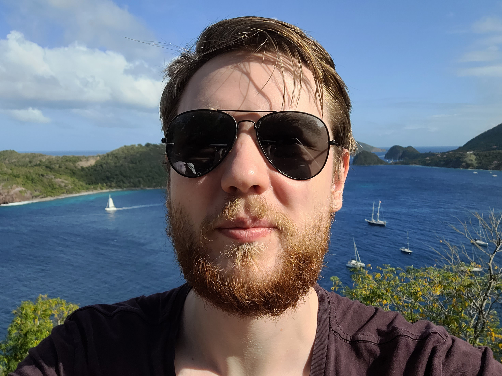
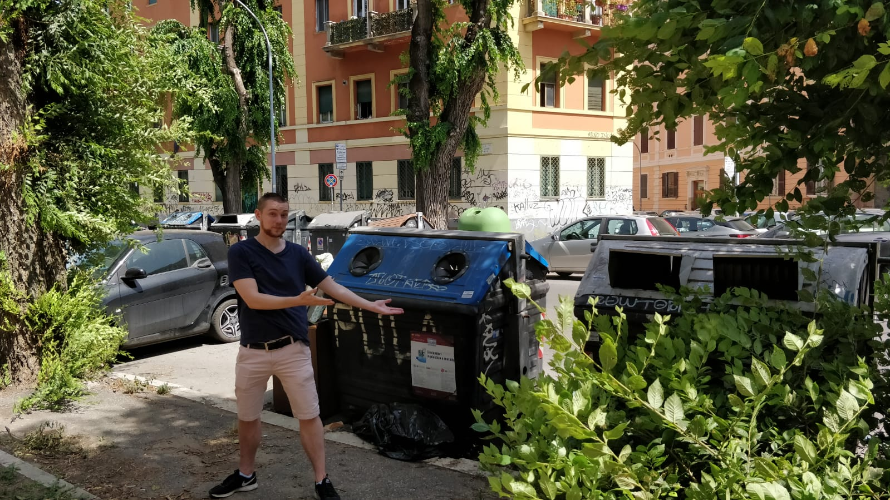

# Meet the Team!

## Max Prime

👋 CEO — 💌 maxprime@maxinc.com — 🇺🇸 San Francisco (GMT-7)

### Bio

The best Max.

## Max Power

👋 CTO — 💌 power@maxinc.com — 🇳🇱 Amsterdam (GMT+1)

### Bio

The coolest Max, because everyone knows that sunglasses automatically makes you \~50% cooler.

## Yung Max

👋 Head of Product — 💌 breal@maxinc.com — 🇫🇷 Marseille (GMT+1)

### Bio

Yung Max needs no Bio. Also he refers to himself in third person.
